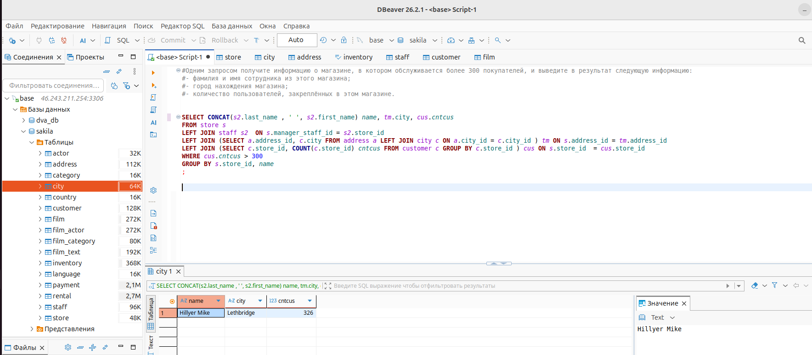
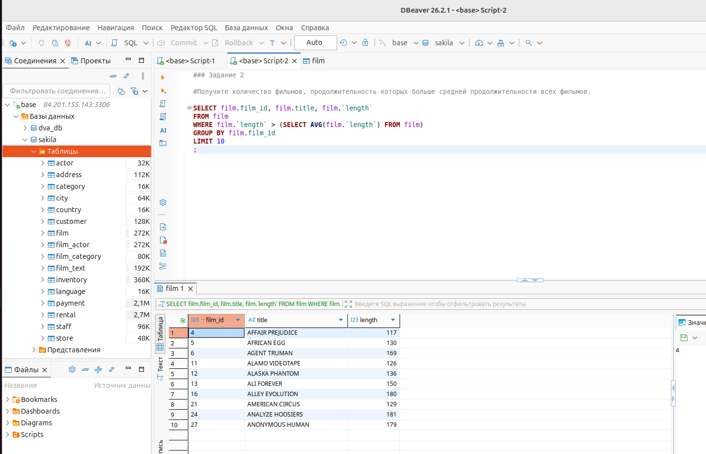
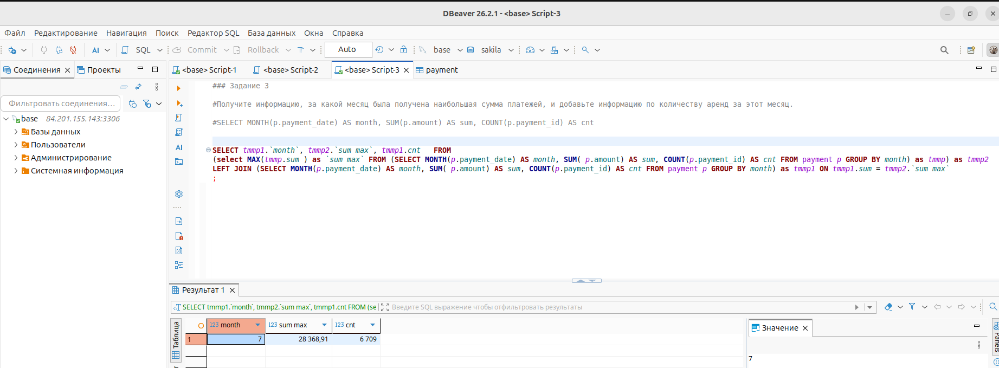

# Дорохов В.А. Домашнее задание к занятию «SQL. Часть 2»


Задание можно выполнить как в любом IDE, так и в командной строке.

### Задание 1

Одним запросом получите информацию о магазине, в котором обслуживается более 300 покупателей, и выведите в результат следующую информацию: 
- фамилия и имя сотрудника из этого магазина;
- город нахождения магазина;
- количество пользователей, закреплённых в этом магазине.

#### Ответ:

```
SELECT CONCAT(s2.last_name , ' ', s2.first_name) name, tm.city, cus.cntcus 
FROM store s
LEFT JOIN staff s2  ON s.manager_staff_id = s2.store_id 
LEFT JOIN (SELECT a.address_id, c.city FROM address a LEFT JOIN city c ON a.city_id = c.city_id ) tm ON s.address_id = tm.address_id  
LEFT JOIN (SELECT c.store_id, COUNT(c.store_id) cntcus FROM customer c GROUP BY c.store_id ) cus ON s.store_id  = cus.store_id 
WHERE cus.cntcus > 300
GROUP BY s.store_id, name
; 
```


### Задание 2

Получите количество фильмов, продолжительность которых больше средней продолжительности всех фильмов.

#### Ответ:

```
SELECT film.film_id, film.title, film.`length`
FROM film 
WHERE film.`length` > (SELECT AVG(film.`length`) FROM film)
GROUP BY film.film_id
;
```


### Задание 3

Получите информацию, за какой месяц была получена наибольшая сумма платежей, и добавьте информацию по количеству аренд за этот месяц.

#### Ответ:

```
SELECT tmmp1.`month`, tmmp2.`sum max`, tmmp1.cnt   FROM 
(select MAX(tmmp.sum ) as `sum max` FROM (SELECT MONTH(p.payment_date) AS month, SUM( p.amount) AS sum, COUNT(p.payment_id) AS cnt FROM payment p GROUP BY month) as tmmp) as tmmp2
LEFT JOIN (SELECT MONTH(p.payment_date) AS month, SUM( p.amount) AS sum, COUNT(p.payment_id) AS cnt FROM payment p GROUP BY month) as tmmp1 ON tmmp1.sum = tmmp2.`sum max` 
;
```



